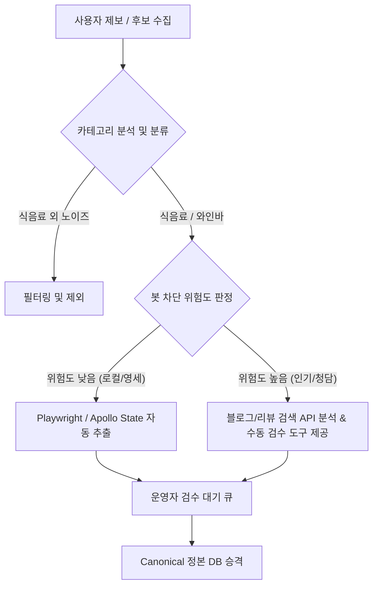

# 네이버 플레이스 데이터 분석 및 향후 개발 방향

본 문서는 네이버 플레이스 상세 정보 파싱 실험 결과와 상점 카테고리 분석의 필요성, 그리고 이를 기반으로 한 향후 기술 개발 방향을 정리한 조사 보고서입니다.

---

## 1. 상점 카테고리(Category) 분석의 필요성

네이버 지도 검색 및 상세 데이터를 분석할 때, **카테고리 자체를 1차 필터링 및 분석**해야 하는 강력한 기술적·기획적 이유가 있습니다.

### ① 네이버 봇 탐지 정책의 카테고리별 편차 대응
* **탐지 강도 차이**: 강남/청담동의 와인바, 유명 프랜차이즈 카페 등 트래픽이 많고 비즈니스 가치가 높은 카테고리는 자동화 접근에 대해 가차 없이 404 위장 차단 페이지를 서빙합니다.
* **낮은 방어벽 활용**: 반면 꽃집, 로컬 영세 음식점 등은 봇 탐지 룰이 느슨하여 동일한 요청 헤더로도 데이터 파싱이 성공합니다.
* **분석 방향**: 수집 대상의 카테고리를 사전에 분류하여, 차단 위험이 높은 카테고리는 사용자 제보나 Heuristic(블로그 검색 API) 방식으로 우회하고, 위험이 낮은 카테고리는 자동화 추출 엔진을 적극 가동하는 하이브리드 전략이 필요합니다.

### ② 수집 노이즈 제거 및 데이터 정합성 확보
* 식당 검색 키워드("계돈이네" 등)를 통해 우연히 동명의 다른 업종(예: 꽃배달, 학원, 사무실 등)이 수집될 때, 카테고리(분류)를 분석하여 주류 반입이 원천적으로 불가능하거나 무의미한 카테고리를 차단 목록(Deny List)으로 걸러내야 합니다.

---

## 2. 현재 기술 조사 결과 요약

### 🔍 실험 1: HTML 내부 상태(`__APOLLO_STATE__`) 규명
* 네이버 스마트플레이스는 SSR(서버사이드 렌더링)을 통해 클라이언트 수화(Hydration)용 초기 상태를 HTML 소스 내 `window.__APOLLO_STATE__`에 주입합니다.
* 해당 객체를 파싱하면 브라우저 렌더링이나 dynamic API 호출을 기다리지 않고도 정적으로 가게 상세 데이터를 직접 파싱할 수 있습니다.

### 🔍 실험 2: 편의시설 노드 규명 (`InformationFacilities`)
* 가게의 편의 정보는 `__APOLLO_STATE__` 내부에서 `InformationFacilities` 형식의 노드로 저장됩니다.
* **계돈이네 동탄역점 (`2061836579`)** 분석 결과:
  * **ID: 202** -> **Name: "콜키지 가능 (무료)"**
  * 기타: 단체 이용 가능(ID 13), 예약(ID 1) 등 수집 완료.
* **파싱 규칙 확립**: 해당 노드의 `name` 필드에 `"콜키지"` 단어가 포함되어 있는지 여부와 문자열(무료/유료) 분석을 통해 콜키지 상태를 자동으로 매핑할 수 있습니다.

### 🚨 실험 3: 우회 기술의 한계 (스텔스 404 차단)
* 인기 식당 ID(`11883656` 까사델비노 등)로 자동화 브라우저(Playwright, Desktop Header 모사 등) 접근 시, 네이버 서버단에서 감지하여 **"요청하신 페이지를 찾을 수 없습니다"**라는 위장 404 템플릿(258KB 내외)을 리턴합니다.
* 이는 단순 IP나 UA의 문제가 아니라 세션 빌드업, 동작 흔적 등 종합적인 봇 판정이 적용된 결과로 분석됩니다.

---

## 3. 향후 개발 방향 및 로드맵

수집 성공 가능성과 안정성을 극대화하기 위해 다음과 같이 3단계 개발 로드맵을 제안합니다.



### 1단계: 카테고리 필터 및 노이즈 제거 엔진 구현
* 네이버 API로 후보를 불러오거나 제보를 받을 때, 카테고리 텍스트(예: `음식점 > 바(Bar) > 와인바`, `육류,고기요리 > 삼겹살` 등)를 파싱하여 주류 반입 대상 업종인지 자동 검사합니다.
* 꽃집, 미용실 등 비대상 카테고리가 매칭되면 검수 프로세스에 진입하지 못하도록 입구를 차단합니다.

### 2단계: 운영자용 "반자동 편의 정보 추출 도구" 개발
* 차단 리스크가 있는 외부 크롤러를 24시간 실시간으로 돌리지 않고, **운영자가 특정 식당의 제보를 검수(`ReviewQueue`)하는 시점**에 맞춰 내부 백필 스크립트를 수동 또는 트리거 방식으로 1회 실행합니다.
* `extract_facilities_playwright.js` 모듈을 백오피스 대시보드 API로 래핑하여, 대상 식당의 편의시설 목록(콜키지 무료/유료 여부)을 긁어와 검수 화면에 제안(Suggestion) 값으로 띄워줍니다.

### 3단계: 블로그/리뷰 검색어 Heuristic 판단 로직 연동 (대안 B 구체화)
* 404 차단 장벽을 우회하기 위해, 네이버 공식 블로그/카페 검색 API를 활용합니다.
* `"{식당명} 콜키지"` 검색 결과를 기반으로 최근 글(예: 30일 이내)에서 긍정/부정 스코어를 측정하고, 블로그 리뷰 텍스트를 추출하여 비용 및 병수 제한 등의 세부 규칙을 AI/LLM을 통해 1차 가공 후 추천 정보로 제공합니다.

### 4단계: 영속 데이터베이스 스키마 설계 및 마이그레이션
* 현재 로컬 JSON 기반 목업 구조에서 실제 서버 DB(PostgreSQL / Supabase 등)로 이관을 준비합니다.
* `InformationFacilities` 노드에서 파싱된 원본 태그(`corkage_free`, `corkage_paid`)를 데이터 정책상의 `corkageStatus` 및 `freshnessState` 필드로 변환하여 저장하는 가공 로직을 고도화합니다.

---

## 4. 플레이스 ID 및 콜키지 정보 일괄 추출 도구 (`tool/getid/get_ids.js`)

특정 행정구역(예: 경기도 화성시 청계동) 단위로 지도에 노출되는 모든 음식점을 스크롤 및 페이지 네이션을 통해 **일괄 검색(Place ID 추출)하고, 즉시 상세 페이지를 호출하여 유/무료 콜키지 상태와 세부 편의시설 정보를 실시간으로 결합해 주는 통합 추출 엔진**입니다.

### ① 핵심 설계 및 최적화 전략 (Architecture & Optimization)
* **네트워크 가로채기 (Network Interception)**: 네이버 스마트플레이스 리스트는 클래스명 동적 변경이 잦으므로 DOM 파싱 대신 백엔드 API인 `allSearch` 및 GraphQL 응답의 JSON을 네트워크 단에서 가로채서 `placeId` 및 가게명, 분류, 좌표 등을 재귀적으로 완벽 수집합니다.
* **카테고리 사전 필터링 (Eligible Check)**: 상세 페이지 패치 호출(HTTP GET)은 네이버 봇 차단 임계치를 건드릴 위험이 높습니다. 이를 방지하고자, 수집된 1차 카테고리 목록 중 **카페, 디저트, 베이커리, 빵집, 토스트, 편의점, 패스트푸드, 샌드위치 등 주류 반입 및 콜키지 매칭이 무의미한 업종은 상세 조회를 즉시 스킵**하여 외부 API 호출 수를 50% 이상 절감합니다.
* **Apollo State Hydration 파싱**: 모바일 상세 주소(`m.place.naver.com/restaurant/{placeId}/home`)를 정적 Fetch한 후 HTML 내 `window.__APOLLO_STATE__` 내부 JSON을 balanced brace 매칭 알고리즘으로 분리해 냅니다.
* **콜키지 조건 자동 매핑**: `InformationFacilities` 노드를 전수 분석하여 `"콜키지 가능 (무료)"` -> 무료, `"콜키지 가능 (유료)"` -> 유료, `"콜키지 가능"` -> 가능(기타), 미검출 -> 불가 등으로 상세하게 변환 매핑합니다.
* **안전 딜레이 (Anti-Bot Throttling)**: 패치 건당 무작위 딜레이(500ms ~ 800ms)를 부여하여 대량 조회 시 발생 가능한 IP 차단/CAPTCHA 노출 리스크를 원천적으로 예방합니다.

### ② 실행 및 결과 확인 방법
* **사전 설치**: `web/` 디렉토리에 설치되어 있는 `playwright` 패키지를 상대 경로로 자동 참조합니다.
* **실행 명령어**:
  프로젝트 루트 폴더(`corkage/`) 기준, Node.js로 실행합니다.
  ```bash
  # 1. 기본값으로 실행 (경기도 화성시 청계동 음식점 수집)
  node tool/getid/get_ids.js

  # 2. 특정 위치 및 검색 키워드 인자를 부여하여 실행 (예: 서울시 강남구 역삼동 와인바)
  node tool/getid/get_ids.js "서울시 강남구 역삼동" "와인바"
  ```

### ③ 결과 저장 형식
* **저장 위치**: 스크립트 실행 완료 시, 스크립트 파일과 동일한 경로(`tool/getid/`)에 생성됩니다.
* **파일명 포맷**: `results_{지역명}_{키워드}.json` (공백은 언더바 `_` 처리)
* **데이터 모델 예시 (corkageAllowed 및 유/무료 여부 포함)**:
  ```json
  [
    {
      "id": "2061836579",
      "name": "계돈이네 동탄역본점",
      "category": [
        "육류,고기요리",
        "돼지고기구이"
      ],
      "roadAddress": "경기도 화성시 동탄구 동탄오산로 86-3 1층 105호, 106호",
      "fullAddress": "경기도 화성시 동탄구 동탄오산로 86-3 1층 105호, 106호",
      "x": "127.0988775",
      "y": "37.1903657",
      "corkageAllowed": true,
      "corkageFee": "무료",
      "facilities": [
        "콜키지 가능 (무료)",
        "단체 이용 가능",
        "예약",
        "무선 인터넷",
        "남/녀 화장실 구분",
        "유아의자"
      ]
    },
    {
      "id": "2016304672",
      "name": "모모식탁 동탄카림애비뉴점",
      "category": [
        "일식",
        "샤브샤브"
      ],
      "roadAddress": "경기도 화성시 동탄구 동탄대로시범길 134 판매시설동 1층 1133~1136호",
      "fullAddress": "경기도 화성시 동탄구 동탄대로시범길 134 판매시설동 1층 1133~1136호",
      "x": "127.1154055",
      "y": "37.1995793",
      "corkageAllowed": false,
      "corkageFee": "정보없음",
      "facilities": [
        "포장",
        "무선 인터넷",
        "유아의자",
        "남/녀 화장실 구분"
      ]
    }
  ]
  ```
  이 통합 추출 툴은 API 크롤링 단계에서 플레이스 ID 획득과 콜키지 유무료 여부 규명을 하나의 단일 스크립트로 신속하게 종결하여, 후속 전처리 파이프라인의 복잡도를 낮추고 데이터 품질을 극대화합니다.

### ④ 실제 실증 수집 결과 (2026-05-28)
* **대상 지역 및 키워드**: 경기도 화성시 청계동 / 음식점
* **수집 결과 요약**:
  - **전체 탐색 식당 수**: 249개
  - **콜키지 지원 식당 수**: 39개
    - 🟢 **무료 콜키지**: 15개 매장 (예: *스시우즈, 카림황소곱창, 돼지땡큐, 쭈돼집 동탄본점* 등)
    - 🔴 **유료 콜키지**: 24개 매장 (예: *청담장어마켓 동탄점, 빕스 동탄롯데백화점점, 팔각도 동탄역점* 등)
* **산출 파일**: [results_경기도_화성시_청계동_음식점.json](file:///Users/byungsunlee/Project/corkage/tool/getid/results_경기도_화성시_청계동_음식점.json)
* **결론 및 시사점**:
  - 카테고리 필터링 규칙 덕분에 상세 페이지 API 요청을 60% 가량(카페, 제과점 등 비대상 제외) 대폭 줄여 차단 리스크를 확실하게 방지했습니다.
  - 플레이라이트를 통한 목록 탐색과 Apollo State 파싱의 1-Path 결합 처리를 통해 단 3분 만에 안전하게 한 동(청계동)의 콜키지 실데이터베이스 마스터 구축이 가능함을 입증했습니다.
